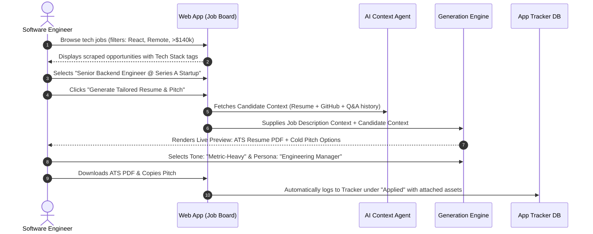
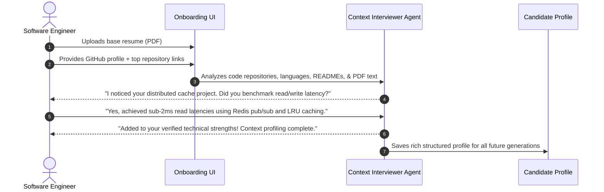

# Product Description: GetYourTemplate (Tech Job Discovery & Tailored Outreach Platform)

**Document Version:** 1.0.0  
**Status:** Approved Specification  
**Target Domain:** Software Engineering & Tech Roles (Expandable to broader tech/product ecosystems)  
**Classification:** Product Requirements & Architecture Document  

---

## 1. Executive Summary & Vision

### 1.1 Overview
**GetYourTemplate** (working name *PitchCraft / GetYourTemplate*) is an all-in-one career acceleration platform tailored specifically for software engineers and technical talent. The platform bridges the gap between fragmented tech job listings, applicant tracking systems (ATS), and cold executive outreach.

Rather than forcing engineers to endlessly reformat resumes or guess how to get hiring managers' attention, the platform offers an integrated dual-engine experience:
1. **Aggregated & Scraped Tech Opportunities Board**: Curates high-signal tech roles from startup directories, leading ATS portals, and major aggregators.
2. **Context-Aware AI Career Studio**: Ingests existing resumes, inspects GitHub repositories, and conducts an interactive "back-and-forth" AI interview with the candidate to capture deep architectural, metric-driven achievements.
3. **One-Click Application Generation**: Directly from any job listing, generates both an **ATS-optimized, high-scoring PDF resume** tailored to the role's exact requirements and a **hyper-personalized cold outreach email** tailored to target decision-makers (Founders, Engineering Managers, Recruiters).

```
                      +------------------------------------------+
                      |         GetYourTemplate Platform         |
                      +------------------------------------------+
                                           |
                 +-------------------------+-------------------------+
                 |                                                   |
      [ Job Discovery Engine ]                            [ Candidate Context Agent ]
                 |                                                   |
  * Scrapes YC, Wellfound, ATS, LinkedIn             * Ingests existing PDF Resumes
  * Tech Stack, Exp, Compensation Filters            * Analyzes GitHub Repos & Products
  * Direct Apply Links                               * Conversational "Back & Forth" Interview
                 |                                                   |
                 +-------------------------+-------------------------+
                                           |
                       [ 1-Click Job-Tailored Generation ]
                                           |
                 +-------------------------+-------------------------+
                 |                                                   |
     [ ATS-Compliant Resume PDF ]                     [ Persona Cold Outreach Pitch ]
  * Keyword & Competency Alignment                 * Founder / Eng Manager / Recruiter
  * Clean, Machine-Parsable Layout                 * Punchy / Metric-Heavy / Conversational
                 |                                                   |
                 +-------------------------+-------------------------+
                                           |
                          [ Application Kanban Tracker ]
                       (Saved -> Applied -> Interview -> Offer)
```

---

## 2. Problem Statement & Market Opportunity

| Existing Pain Point | Traditional Consequence | GetYourTemplate Solution |
| :--- | :--- | :--- |
| **Fragmented Tech Job Listings** | Engineers check 5+ distinct portals (YC, LinkedIn, Greenhouse links, Wellfound) with redundant filters. | Unified scraper aggregating tech listings with engineering-specific filters (stack, level, remote, compensation). |
| **The "ATS Black Hole"** | Generic resumes are rejected by automated ATS parsers due to formatting errors or missing semantic skill keywords. | Generates clean, machine-parsable, ATS-optimized PDFs tailored specifically to the targeted job description. |
| **Generic Cold Emails Ignored** | Template-spam emails sent to founders and engineering managers yield < 2% response rates. | Persona-targeted outreach (Founder vs. EM vs. Recruiter) packed with relevant technical hooks and tone presets. |
| **Superficial Resume Builders** | Standard resume builders use static text boxes that fail to extract the real depth of an engineer's technical projects. | Conversational AI Agent interviews the engineer, analyzes their GitHub repos, and extracts concrete metrics and architectural decisions. |

---

## 3. User Personas & Target Audience

### 3.1 Primary Personas
- **The Modern Software Engineer (Junior to Senior)**: Actively hunting for high-growth tech or startup roles; wants fast, high-quality, tailored applications without spending 3 hours per role.
- **The Staff / Lead Engineer**: Looking for leadership or high-impact opportunities; requires high-context pitches to founders and VP of Engineering highlighting architectural scaling and team impact.
- **The Open-Source / Project Builder**: Has strong GitHub repos, side products, or open-source contributions, but struggles to translate technical commits into an ATS-friendly, business-impactful resume.

---

## 4. Product Modules & Feature Specifications

### 4.1 Module 1: Tech Job Discovery Engine
A focused, real-time job board indexing opportunities across the tech industry.

* **Target Scraping Sources**:
  * **Startup Boards**: *Y Combinator (Work at a Startup)*, *Wellfound (AngelList)*.
  * **Direct ATS Portals**: *Greenhouse.io*, *Lever.co*, *AshbyHQ*.
  * **Major Aggregators**: *LinkedIn Jobs*, *Indeed Tech*.
* **Scraped Data Attributes**:
  * Company Name, Logo/Domain, Company Stage (Seed, Series A–C, Public / Enterprise).
  * Job Title, Engineering Level (Junior, Mid, Senior, Staff/Lead).
  * Required Tech Stack (e.g., TypeScript, Go, Python, React, Kubernetes, AWS).
  * Work Mode (Remote, Hybrid, On-site) & Timezone / Location constraints.
  * Salary / Equity Compensation range (normalized where available).
  * Job Description & Technical Requirements breakdown.
  * Direct Canonical Apply URL.
* **Engineering Filters**:
  * Multi-select technology tags (e.g., `Node.js` + `Postgres` + `Remote`).
  * Seniority slider / chips.
  * Minimum base compensation threshold.
  * Company funding / stage filter.

---

### 4.2 Module 2: The Deep Candidate Context Engine (AI Interviewer)
Rather than a passive form, the platform uses an intelligent context extraction pipeline to build a 360-degree technical profile of the engineer.

* **Multi-Modal Candidate Ingestion**:
  * **Resume Upload**: Parses existing PDF resumes using high-fidelity text and structure extraction.
  * **GitHub Profile & Project Ingestion**: Takes GitHub profile and repository links; inspects project `README.md`, repository languages, dependencies, and commit summaries.
  * **Product Descriptions**: Captures deployed web app URLs, live demos, and product descriptions provided by the user.
* **Interactive Conversational "Back-and-Forth" Agent**:
  * The agent detects ambiguous or weak bullet points (e.g., *"Built a backend service"*).
  * Interactively prompts the candidate: *"What was the peak throughput? Did you use Redis or database indexing to optimize latency? What framework did you use?"*
  * Continues until a comprehensive **Candidate Master Context Graph** is constructed.
* **Candidate Context Storage**: Securely stores skills, project architectures, achievements, and quantified metrics for re-use across all future job applications.

---

### 4.3 Module 3: 1-Click Job-Tailored Asset Generator
When browsing any opportunity on the job board, the user can click **"Create Tailored Resume & Cold Pitch"**.

* **Dynamic Context Fusion**:
  * Merges the **Job Requirements** (scraped stack, responsibilities, culture) with the **Candidate Master Context**.
  * Identifies the exact overlap and high-priority keywords without deceptive fabrication.
* **ATS-Compliant Resume Generation**:
  * Produces single-column, standard-compliant ATS typography (Inter / Helvetica / Arial equivalent structure).
  * Eliminates tables, complex multi-column grids, and unsupported graphic icons that break standard ATS parsers.
  * Re-ranks and rephrases project bullets to emphasize the technologies and competencies highlighted in the specific job listing.
  * **Export Format**: Clean, downloadable ATS-friendly PDF.
* **Personalized Cold Outreach Pitch**:
  * **Persona-Specific Positioning**:
    * **Founder / CEO**: Focuses on velocity, product ownership, business impact, and startup grit.
    * **Engineering Manager (EM)**: Focuses on architectural patterns, code quality, maintainability, team velocity, and stack proficiency.
    * **Technical Recruiter**: Focuses on clear keyword alignment, years of experience, relevant certifications, and immediate availability.
  * **Tone Presets**:
    * `Punchy`: Short, bold, ultra-direct (< 120 words).
    * `Metric-Heavy`: Quantified results, percentages, latency drops, revenue metrics.
    * `Conversational`: Friendly, authentic developer-to-developer tone.
  * **Quick Actions**: One-click copy to clipboard, editable preview, and dynamic subject line generator.

---

### 4.4 Module 4: Standalone Career Studio
For applications found outside the built-in job board (e.g., referral links, Twitter/X posts, direct recruiter emails):
* **Custom Job Description Input**: Users can paste any external job description or company link.
* **Independent Resume Generator**: Generate or refresh ATS-friendly resumes on demand.
* **Standalone Cold Email Crafter**: Retains the existing core capability (`/analyse` and `/craft` routes) for ad-hoc pitch generation.

---

### 4.5 Module 5: Lightweight Application Tracker (Kanban)
Keeps the candidate organized without requiring third-party spreadsheets:
* **Kanban Columns**:
  1. `Saved / Researching`
  2. `Applied` (Direct Apply link used)
  3. `Outreach Sent` (Cold email sent to founder/recruiter)
  4. `Interviewing` (Screen, Technical, Onsite)
  5. `Offer Received` / `Archived`
* **Attached Assets**: Each card automatically stores the specific tailored PDF resume version and cold pitch generated for that opportunity.
* **Activity Timestamps**: Tracks application date and suggests follow-up intervals (e.g., 5 days post-cold email).

---

## 5. User Journeys & End-to-End Workflows

### Journey A: Job Discovery to Tailored Application


### Journey B: First-Time Onboarding & Deep Context Gathering


---

## 6. Access Control & Monetization Model

### 6.1 Authentication & Gating
* **Guest / Public Tier**:
  * Unrestricted access to browse and filter the scraped tech job opportunities board.
  * Direct apply links visible to all visitors.
  * Sample preview of resume and cold email generation.
* **Free Registered Tier (Mandatory Sign-Up)**:
  * Full Candidate Context profile creation (PDF upload, GitHub link indexing, initial AI interview).
  * Limited generation quota: e.g., **3 tailored resume PDFs & 5 cold email generations per week**.
  * Access to the lightweight Kanban application tracker.
* **Pro Tier (Paid Subscription / Credits)**:
  * **Unlimited** tailored ATS resume generations and PDF downloads.
  * **Unlimited** cold outreach generations with all persona models.
  * Deep GitHub codebase indexing (automated project bullet formulation from code commits).
  * Multi-version resume saving and prioritized scraping feeds.

---

## 7. Technical Architecture & System Design

### 7.1 High-Level Architecture
* **Frontend**: Next.js 14+ (App Router), React, Tailwind CSS, Lucide icons, Framer Motion for micro-interactions, PDF renderers (`@react-pdf/renderer` or clean HTML-to-PDF engine).
* **Backend API**: Node.js / TypeScript with Express (modularized under `/routes` and `/handlers`), Zod validation schemas.
* **Scraper Infrastructure**:
  * Scheduled worker jobs (Cron / BullMQ / Serverless workers) scraping public ATS APIs (Greenhouse public job feeds, Lever API endpoints, Ashby public postings) and authorized job feeds.
  * Deduplication engine: Normalizes company names, job titles, and detects duplicate postings across multiple aggregators.
* **LLM & Agent Pipeline**:
  * PDF text extraction engine (`pdf-parse`).
  * GitHub repository analyzer (fetching repo metadata, primary language stats, README content via GitHub REST API).
  * Conversational Agent utilizing structured prompting (System instructions targeting ATS compliance, metric extraction, and persona writing).

### 7.2 Core Data Models (Relational / Document)
* `User`: Credentials, profile metadata, subscription tier.
* `CandidateProfile`: Parsed resume text, GitHub handle, indexed project summaries, skills matrix.
* `JobListing`: Source, company, title, requirements, stack, salary range, location, direct URL, active status.
* `ApplicationRecord`: Status (`SAVED`, `APPLIED`, `INTERVIEWING`, `OFFERED`), customized resume snapshot, generated pitches, notes.

---

## 8. Non-Functional Requirements & Design Principles

1. **ATS Parseability Benchmark**: Generated PDF resumes must pass standard ATS parsers (Lever, Greenhouse, Workday) with 95%+ text readability and accurate section boundary recognition.
2. **Speed & Latency**:
   * Job board search and filtering latency: `< 150ms`.
   * Real-time generation of resume PDF + cold outreach: `< 8s` (with progressive streaming indicator).
3. **Privacy & Data Security**:
   * Uploaded resumes and private repo tokens (if provided) are encrypted at rest.
   * User resumes and interview answers are never sold or shared with third-party advertisers.
4. **Clean, Modern Developer-Centric UI**:
   * Minimalist, typography-driven aesthetic (Geist / Inter fonts, neutral stone/slate tones, dark mode support).
   * Keyboard-friendly shortcuts for rapid job browsing.

---

## 9. Phased Execution Roadmap

```
Phase 1: Foundation & MVP (Current)
├── Enhanced Job Scraper: Greenhouse, Lever, YC Startup feeds
├── Context Interviewer: PDF resume parsing + basic GitHub link analysis
├── ATS Resume Generator: Clean single-column PDF export
└── Cold Outreach Engine: Persona presets (Founder, EM, Recruiter)

Phase 2: Platform Maturation
├── Full Application Tracker (Interactive Kanban board)
├── Deep GitHub Commit & Architecture Parser
├── Expanded Job Aggregators (LinkedIn, Indeed tech feeds)
└── User Accounts & Freemium Stripe Subscription Integration

Phase 3: Ecosystem Expansion
├── Chrome Extension (1-click tailoring on external job pages)
├── Direct Email Integration (Send via Gmail / Outlook with open tracking)
└── Expansion into adjacent tech disciplines (DevOps, Data Engineering, Product Management)
```
